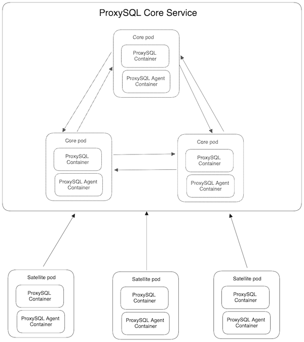

# ProxySQL Agent

## About

The ProxySQL agent is a small, statically compiled go binary for use in maintaining the state of a [ProxySQL](https://github.com/sysown/proxysql) cluster, for use as a kubernetes sidecar container. The repo includes a [Dockerfile](build/Dockerfile) to generate an alpine based image, or you can use the version in the [GitHub Container Registry]().

There exists relatively little tooling around ProxySQL, so we hope that this is useful to others out there, even if it's just to learn how to maintain a cluster.

### "Self healing" the ProxySQL cluster

This is mainly useful in a kubernetes deployment if you have a horizontal pod autoscaler defined for satellite and/or core pods; as these pods scale in and out, the state of the ProxySQL cluster needs to be maintained. If you are running a static cluster on VMs and the hosts rarely change, or you don't use an HPA, this probably won't be as useful to you (though there are some features coming that might help with even that).

Some examples of where this is necessary:

- As satellite pods scale in, one of the core pods need to run `LOAD PROXYSQL SERVERS TO RUNTIME` in order to accept the new pods to the cluster; until that is done, the satellite pod will not receive configuration from the core pods
- As core pods recycle (or all core pods are recycled) and IPs to them change, the satellites need to run some commands to load the new core pods into runtime
- If _all_ core pods recycle, the satellite pods will run `LOAD PROXYSQL SERVERS FROM CONFIG` which points them to the `proxysql-core` service, and once the core pods are up the satellites should receive configuration again
  - Note that if your cluster is running fine and the core pods all go away, the satellites will continue to function with the settings they already had; in other words, even if the core pods vanish, you will still serve proxied MySQL traffic as long as the satellites have fetched the configuration once

### Why did you pick golang, if you work at a Ruby shop?

We looked into using ruby, and in fact the "agents" we are currently running **are** written in ruby, but there have been some issues:

- If the ProxySQL admin interface gets wedged, the ruby and mysl processes still continue to spawn and spin, which will eventually lead to either inode exhaustion or a container OOM
  - The scheduler spawns a new ruby process every 10s
    - Each ruby process shells out to the mysql binary several times times per script invocation
  - In addition to the scheduler process, the health probes is a separate ruby script that also spawns several mysql processes per run
    - Two script invocations every 10s, one for liveness and one for readiness

We wanted to avoid having to install a bunch of ruby gems in the container, so we decided shelling out to mysql was fine; we got most of the patterns from existing ProxySQL tooling and figured it'd work short term. And it has worked fine, though there have been enough instances of OOM'd containers that it's become worrisome. This usually happens if someone is in a pod doing any kind of work (modifying mysql query rules, etc), but we haven't been able to figure out what causes the admin interface to become wedged.

Because k8s tooling is generally written in Golang, the ruby k8s gems didn't seem to be as maintained or as easy to use as the golang libraries. And because the go process is statically compiled, and we won't need to deal with a bunch of external dependencies at runtime.

## Design

In the [example repo](https://github.com/kuzmik/local-proxysql), there are two separate deployments; the `core` and the `satellite` deployments. The agent is responsible for maintaining the state of this cluster.

On boot, the agent will connect to the ProxySQL admin interface on `127.0.0.1:6032` (default address). It will maintain the connection throughout the life of the pod, and will periodicially run the commands necessary to maintain the cluster, depending on the run mode specified on boot.

Additionally, the agent also exposes a simple HTTP API used for k8s health checks for the pod, as well as the /shutdown endpoint, which can be used in a `container.lifecycle.preStop.httpGet` hook to gracefully drain traffic from a pod before stopping it.

## TODOs

There are some internal linear tickets, but here's a high level overview of what we have in mind.

- *P3* - HTTP API for controlling the agent. Much to do here, many ideas
  - get proxysql admin status
  - force a satellite resync (if running in satellite mode)
  - etc

### Done

- *P1* - ~~Dump the contents of `stats_mysql_query_digests` to a file on disk; will be used to get the data into snowflake. File format is CSV~~
- *P1* - ~~Health checks; replace the ruby health probe with this~~
- *P2* - ~~Replace the pre-stop ruby script with this~~
- *P2* - ~~Better test coverage~~

### MVP Requirements

1. ✅ Cluster management (ie: core and satellite agents)
1. ✅ Health checks via an HTTP endpoint, specifically for the ProxySQL container
1. ✅ Pre-stop hook replacement

## Releasing a new version

We are using [goreleaser](https://goreleaser.com/), so it's as simple as pushing to a new tag:

1. `git tag vX.X.X`
1. `git push origin vX.X.X`

This will cause goreleaser to run and output the artifacts; currently we are only shipping a linux amd64 binary and a Docker image.

## See also

Libraries in use:

* [k8s-client-go](https://github.com/kubernetes/client-go) - Golang k8s client
* [slog](https://pkg.go.dev/log/slog) ([examples](https://betterstack.com/community/guides/logging/logging-in-go/)) - log/slog
* [Viper](https://pkg.go.dev/github.com/spf13/viper) - Go configuration library; allows config from a file, ENV, or commandline flags
